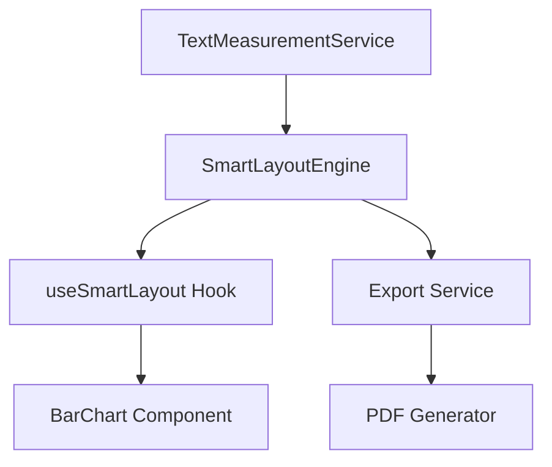

# Implementation Plan Analysis Skill

## Purpose

This skill provides a rigorous framework for analyzing complex implementation plans, technical roadmaps, and architectural documents. It helps identify:

- **Actual vs Claimed Progress**: What's truly implemented vs what's marked as done
- **Duplications**: Redundant logic, repeated concepts, overlapping sub-projects
- **Contradictions**: Conflicting requirements, incompatible strategies, unclear priorities
- **Optimization Opportunities**: How to consolidate, prioritize, and improve the plan

## When to Use

Apply this skill when:

1. **Reviewing Large Plans**: Implementation plans with 10+ sub-projects or phases
2. **Before Major Refactors**: To understand what exists and what's actually needed
3. **Debugging Confusion**: When team is unclear about what to implement next
4. **Post-Mortem Analysis**: After discovering that "completed" work isn't actually done
5. **Plan Consolidation**: When multiple documents describe overlapping work

## Core Principles

### 1. **Evidence-Based Assessment**

> "Trust the code, not the checkboxes"

- **Always verify** claimed completion against actual codebase
- **Search for imports/usage** of supposedly implemented features
- **Run the code** to confirm functionality
- **Compare** plan descriptions with actual implementation

### 2. **Systematic Coverage**

Analyze in this order:

1. **Status Audit** (What's done?)
2. **Duplication Detection** (What's repeated?)
3. **Contradiction Analysis** (What conflicts?)
4. **Optimization Recommendations** (How to improve?)

### 3. **Severity Classification**

Use consistent severity ratings:

- 🔴 **High/Critical**: Blocks implementation or causes bugs
- 🟡 **Medium/Important**: Causes confusion or inconsistency  
- 🟢 **Low/Minor**: Documentation imprecise but code works

## Analysis Framework

### Phase 1: Status Audit

**Objective**: Determine actual implementation status

#### Steps:

1. **Read the Plan**
   - Identify all claimed completions (`[x]`, `[checked]`, "implemented", etc.)
   - List all sub-projects/phases/tasks
   - Note any verification criteria mentioned

2. **Verify Against Codebase**
   ```bash
   # Search for key files mentioned in plan
   find . -name "SmartLayoutEngine.ts"
   
   # Search for feature usage
   grep -r "useSmartLayout" src/
   
   # Check if types are defined
   grep -r "ComputedLayout" src/
   ```

3. **Create Status Matrix**
   ```markdown
   | Sub-Project | Claimed Status | Files Mentioned | Files Exist | Logic Complete | Actually Done |
   |-------------|----------------|-----------------|-------------|----------------|---------------|
   | 1.1 Foundation | [checked] | Engine.ts, types.ts | ✅ Yes | ⚠️ Partial | 40% |
   ```

4. **Calculate Real Progress**
   - Count total tasks
   - Count truly completed tasks
   - Report: "X% claimed, Y% actual"

#### Output Template:

```markdown
## 📊 Status Atual da Implementação

### ✅ O que JÁ está implementado
[List with evidence: file paths, line numbers, working features]

### ⚠️ O que está PARCIALMENTE implementado
[List with gaps: what exists vs what's missing]

### ❌ O que NÃO está implementado
[List with severity: critical missing pieces first]
```

---

### Phase 2: Duplication Detection

**Objective**: Find redundant logic and repeated concepts

#### Types of Duplication:

1. **Code Duplication** (Same logic in multiple places)
   - Engine calculates X, Component also calculates X
   - Two services doing the same measurement
   - Multiple files with similar utilities

2. **Conceptual Duplication** (Same feature described multiple times)
   - "Legend Intelligence" mentioned in 4 different sub-projects
   - "Label Wrapping" appears in 6 places with different names

3. **Responsibility Duplication** (Unclear ownership)
   - Plan says Engine does X, but Component also does X
   - Both files have fallback logic for the same case

#### Detection Process:

1. **Keyword Extraction**
   ```bash
   # Extract all sub-project titles
   grep "^## Sub-Project" plan.md
   
   # Find repeated keywords
   grep -o "Legend\|Wrapping\|Export\|Density" plan.md | sort | uniq -c
   ```

2. **Cross-Reference Analysis**
   - Create a concept map: which sub-projects touch the same feature?
   - Identify overlapping responsibilities

3. **Code vs Plan Comparison**
   ```typescript
   // If plan says Engine does this:
   SmartLayoutEngine.computeMargins()
   
   // But Component also does this:
   const margin = computedLayout?.margin ?? calculateLegacyMargin()
   
   // → DUPLICATION DETECTED
   ```

#### Output Template:

```markdown
## 🔄 O que está DUPLICADO ou REDUNDANTE

### 1. **[Duplication Name]**
- **Location 1**: [File/Section] does X
- **Location 2**: [File/Section] also does X
- **Problem**: [Why this is bad]
- **Solution**: [How to consolidate]

### Conceptual Overlaps:
- **[Concept]**: Mentioned in Sub-Projects [1.6, 1.27, 1.43, 1.44]
```

---

### Phase 3: Contradiction Analysis

**Objective**: Identify conflicting requirements and strategies

#### Contradiction Patterns:

1. **Direct Conflicts**
   - Sub-Project A: "Always do X"
   - Sub-Project B: "Never do X"

2. **Strategy Conflicts**
   - Phase 1: "Use approach A"
   - Phase 3: "Use approach B instead"
   - (No explanation of why it changed)

3. **Priority Conflicts**
   - Goal 1: "Maximize vertical fill"
   - Goal 2: "Cap at 60px regardless of space"

4. **Responsibility Conflicts**
   - Philosophy: "Engine does everything"
   - Implementation: "Component has guardrails"

#### Detection Process:

1. **Extract Imperatives**
   ```bash
   # Find all "must", "should", "always", "never" statements
   grep -i "must\|should\|always\|never" plan.md
   ```

2. **Compare Strategies**
   - List all strategies for the same problem
   - Check if they're mutually exclusive
   - Verify if there's a documented priority order

3. **Code Reality Check**
   ```typescript
   // Plan says: "marginLeft = 0 for headers"
   // But also says: "never zero margins"
   // Code does: marginLeft = computedLayout?.left ?? 40
   // → Which is correct?
   ```

4. **Create Contradiction Matrix**

#### Output Template:

```markdown
## ⚠️ CONTRADIÇÕES no Plano

### [Number]. **Contradição: [Name]**

**[Source 1] (linha X):**
> "[Quote from plan]"

**[Source 2] (linha Y):**
> "[Conflicting quote]"

**CONTRADIÇÃO**:
- [Source 1] says X
- [Source 2] says Y
- **Problema**: [Why this is a problem]

**Código Atual:**
```typescript
// What the code actually does
```

**Solução Sugerida**: [How to resolve]

**Severidade**: 🔴/🟡/🟢

---

## 📊 Resumo das Contradições

| # | Contradição | Severidade | Status no Código |
|---|-------------|------------|------------------|
| 1 | [Name] | 🔴 Alta | [Status] |
```

---

### Phase 4: Optimization Recommendations

**Objective**: Propose concrete improvements to the plan

#### Optimization Dimensions:

1. **Structure Optimization**
   - Consolidate 50+ micro-tasks into 5-10 phases
   - Group by theme, not chronology
   - Create clear dependencies

2. **Priority Optimization**
   - Add P0/P1/P2/P3 labels
   - Separate MVP from "nice-to-have"
   - Create "Future Enhancements" section

3. **Clarity Optimization**
   - Add specific acceptance criteria
   - Define "Definition of Done"
   - Include exact test commands

4. **Reusability Optimization**
   - Extract common patterns
   - Identify code that can be reused
   - Suggest architectural improvements

#### Recommendation Template:

```markdown
## 💡 Como MELHORAR o Plano

### Problema 1: **[Problem Name]**
- **Situação**: [Current state]
- **Problema**: [Why it's bad]
- **Solução**: [Specific fix]

**Exemplo:**
```markdown
// Before (bad)
## Sub-Project 1.1
## Sub-Project 1.2
...
## Sub-Project 1.55

// After (good)
## FASE 1: Core Engine (P0)
### 1.1 Text Measurement
### 1.2 Dynamic Margins
### 1.3 Label Wrapping
```

### Ações Imediatas Recomendadas:
1. [Action 1]
2. [Action 2]
3. [Action 3]
```

---

## Complete Analysis Workflow

### Step-by-Step Process:

```markdown
1. **Preparation** (5 min)
   - [ ] Read plan document fully
   - [ ] Identify workspace/codebase location
   - [ ] Note any related documents (skills, previous plans)

2. **Status Audit** (15-20 min)
   - [ ] List all claimed completions
   - [ ] Verify each against codebase
   - [ ] Create status matrix
   - [ ] Calculate real progress percentage

3. **Duplication Detection** (10-15 min)
   - [ ] Extract keywords and concepts
   - [ ] Find repeated logic in code
   - [ ] Find repeated concepts in plan
   - [ ] Map overlapping responsibilities

4. **Contradiction Analysis** (15-20 min)
   - [ ] Extract all imperatives
   - [ ] Compare conflicting strategies
   - [ ] Check code vs plan alignment
   - [ ] Rate severity of each contradiction

5. **Optimization Recommendations** (10-15 min)
   - [ ] Identify structural issues
   - [ ] Propose consolidation
   - [ ] Add prioritization framework
   - [ ] Suggest immediate actions

6. **Documentation** (10 min)
   - [ ] Create analysis artifact
   - [ ] Use standard templates
   - [ ] Include code examples
   - [ ] Add summary tables

Total Time: ~60-90 minutes for comprehensive analysis
```

---

## Output Artifact Structure

Create a single `analysis.md` artifact with this structure:

```markdown
# Análise do Plano de Implementação: [Plan Name]

## 📊 Status Atual da Implementação
[Status audit results]

## 🔄 O que está DUPLICADO ou REDUNDANTE
[Duplication findings]

## ⚠️ CONTRADIÇÕES no Plano
[Contradiction analysis with severity ratings]

## 💡 Como MELHORAR o Plano
[Optimization recommendations]

## 🎯 Plano Reorganizado Sugerido
[Optional: Proposed new structure]

## 📋 Ações Imediatas Recomendadas
[Prioritized next steps]

## ✅ Resumo Executivo
### Estado Atual:
- **Implementado**: X%
- **Marcado como done**: Y%
- **Realmente pronto**: [List]

### Problemas Principais:
1. [Problem 1]
2. [Problem 2]

### Recomendações:
1. [Recommendation 1]
2. [Recommendation 2]
```

---

## Quality Checklist

Before delivering analysis, verify:

- [ ] **Evidence-Based**: Every claim has code reference or file path
- [ ] **Specific**: No vague statements like "some things are duplicated"
- [ ] **Actionable**: Each problem has a concrete solution
- [ ] **Prioritized**: Severity ratings are consistent
- [ ] **Comprehensive**: All 4 phases completed
- [ ] **Formatted**: Uses tables, code blocks, severity emojis
- [ ] **Concise**: Analysis is thorough but not repetitive

---

## Common Pitfalls to Avoid

### ❌ Don't:

1. **Trust Checkboxes Blindly**
   - `[x]` doesn't mean it's done
   - Always verify in code

2. **Report Without Evidence**
   - ❌ "The Engine is incomplete"
   - ✅ "The Engine is missing `exportBuffer` logic (line 69 of plan)"

3. **List Problems Without Solutions**
   - Every contradiction needs a suggested resolution

4. **Ignore the Code**
   - Sometimes code is right and plan is wrong
   - Sometimes code has workarounds that should be documented

5. **Be Vague About Severity**
   - Use consistent 🔴🟡🟢 ratings
   - Explain why something is critical vs minor

### ✅ Do:

1. **Show Your Work**
   - Include file paths, line numbers, code snippets
   - Link to conversation history if relevant

2. **Be Constructive**
   - Frame as "optimization opportunities" not "failures"
   - Suggest concrete next steps

3. **Think Like a Senior Engineer**
   - Consider maintainability, not just functionality
   - Identify architectural issues early

4. **Respect Existing Work**
   - Acknowledge what's done well
   - Build on existing patterns when possible

---

## Advanced Techniques

### Dependency Mapping

Create visual dependency graphs:



### Conversation History Mining

Extract learnings from past conversations:

```markdown
## Lessons Learned (from conversation history)

**Conversation 4331873d** (Fix Cropped Chart Exports):
- User struggled with PDF export fidelity
- Resolution: Increased pixelRatio to 3.5
- Lesson: Export needs separate layout calculation

**Conversation 5870325a** (Implement Design Tokens):
- Componentization requires strict separation
- Lesson: Engine should be stateless, Component should be dumb
```

### Skill Cross-Reference

Link to related skills:

```markdown
This plan should align with:
- **componentization** skill: Engine/Component separation
- **task_breakdown** skill: Phased execution
- **system_architecture** skill: Measurement-first, LOD principles
```

---

## Example Usage

```markdown
User: "Analisa pra mim todo o documento @[docs/implementation-plan.md]"

Agent Response:
1. Read the plan document
2. Search codebase for mentioned files
3. Verify claimed completions
4. Detect duplications (code + concepts)
5. Find contradictions (compare all sub-projects)
6. Propose optimizations (consolidate, prioritize)
7. Create comprehensive analysis.md artifact
8. Present summary with severity ratings
```

---

## Success Metrics

A good analysis should:

- **Reveal Hidden Issues**: Find problems not obvious on first read
- **Save Time**: Team knows exactly what to do next
- **Prevent Rework**: Contradictions resolved before coding
- **Improve Quality**: Plan becomes actionable roadmap
- **Build Confidence**: Team trusts the plan is realistic

---

## Related Skills

- **task_breakdown**: Mandatory partner skill. Use plan analysis to validate the breakdown, ensuring complex tasks are decomposed safely.
- **componentization**: Mandatory partner skill. Ensure the plan respects separation of concerns (Engine vs UI) and promotes reusable components.
- **system_architecture**: Apply architectural principles to plan structure.

---

## Maintenance

Update this skill when:

- New contradiction patterns emerge
- Better detection techniques are discovered
- Output format needs improvement
- User feedback suggests refinements
