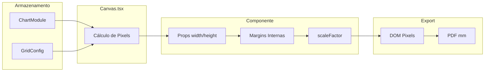

# Referência de Variáveis de Gráficos

> **Objetivo**: Documentação exaustiva de todas as variáveis de posicionamento e dimensionamento dos gráficos, visando o desenvolvimento de um sistema inteligente de layout automático.

---

## 1. Arquitetura de Posicionamento

### 1.1 Fluxo de Dados



### 1.2 Unidades de Medida

| Camada | Unidade | Conversão |
|--------|---------|-----------|
| `GridConfig` | mm | Base |
| `Canvas.tsx` | pixels | `PIXELS_PER_MM = 3.78` |
| Componentes SVG | pixels | Usa props diretamente |
| PDF Export | mm | `scaleFactor = widthMm / domWidth` |

---

## 2. Tipos Base

### 2.1 ChartModule

```typescript
// src/types/index.ts
interface ChartModule {
    x: number;  // Posição X em unidades de grid (0-indexed)
    y: number;  // Posição Y em unidades de grid (0-indexed)
    w: number;  // Largura em módulos
    h: number;  // Altura em módulos
}
```

**Observações:**
- Valores são inteiros representando posição no grid
- `x=0, y=0` é o canto superior esquerdo
- Valores não incluem margens ou gutters

### 2.2 GridConfig

```typescript
interface GridConfig {
    // Estrutura do Grid
    columns: number;          // Número de colunas
    rows: number;             // Número de linhas
    gutter: number;           // Espaço entre módulos (mm)
    
    // Margens (mm)
    margin: number;           // Margem uniforme (legado)
    marginTop?: number;
    marginBottom?: number;
    marginLeft?: number;
    marginRight?: number;
    
    // Formato da Página
    pageFormat: 'A4' | 'A3' | 'A5' | 'Custom';
    orientation: 'portrait' | 'landscape';
    width: number;            // Largura total (mm)
    height: number;           // Altura total (mm)
    
    // Modo de Grid
    mode?: 'flexible' | 'fixed';
    fixedModuleWidth?: number;   // Largura fixa de módulo (mm)
    fixedModuleHeight?: number;  // Altura fixa de módulo (mm)
    
    // Tipografia Base
    baseFontSize?: number;       // Tamanho base da fonte
    baseFontUnit?: 'pt' | 'px' | 'mm';
}
```

---

## 3. Cálculos do Canvas

### 3.1 Conversão Grid → Pixels

```typescript
// Canvas.tsx linhas 130-159
const PIXELS_PER_MM = 3.78;

// Margens em pixels
const mTop = (marginTop ?? margin) * PIXELS_PER_MM;
const mLeft = (marginLeft ?? margin) * PIXELS_PER_MM;
const gutterPx = gutter * PIXELS_PER_MM;

// Modo Flexível: calcula tamanho do módulo
if (mode !== 'fixed') {
    const availableWidth = widthPx - (mLeft + mRight) - ((columns - 1) * gutterPx);
    moduleWidth = availableWidth / columns;
    
    const availableHeight = heightPx - (mTop + mBottom) - ((rows - 1) * gutterPx);
    moduleHeight = availableHeight / rows;
}

// Modo Fixo: usa valores configurados
if (mode === 'fixed') {
    moduleWidth = fixedModuleWidth * PIXELS_PER_MM;
    moduleHeight = fixedModuleHeight * PIXELS_PER_MM;
}
```

### 3.2 Posição e Tamanho Final do Gráfico

```typescript
// Canvas.tsx linhas 472-475
const x = mLeft + module.x * (moduleWidth + gutterPx);
const y = mTop + module.y * (moduleHeight + gutterPx);
const w = module.w * moduleWidth + (module.w - 1) * gutterPx;
const h = module.h * moduleHeight + (module.h - 1) * gutterPx;
```

**Fórmulas:**
- `x = marginLeft + (coluna × (larguraModulo + gutter))`
- `y = marginTop + (linha × (alturaModulo + gutter))`
- `width = (numModulos × larguraModulo) + ((numModulos - 1) × gutter)`
- `height = (numModulos × alturaModulo) + ((numModulos - 1) × gutter)`

---

## 4. Variáveis por Tipo de Gráfico

### 4.1 Padrão Comum (Todos os Gráficos)

| Variável | Tipo | Descrição |
|----------|------|-----------|
| `width` | prop | Largura total disponível (px) |
| `height` | prop | Altura total disponível (px) |
| `baseFontSize` | prop | Tamanho base de fonte (default: 11) |
| `baseFontUnit` | prop | Unidade de fonte ('pt', 'px', 'mm') |
| `style.mode` | prop | 'classic' ou 'infographic' |

### 4.2 Gráficos de Barras (BarChart, ColumnChart)

#### BarChart.tsx - Variáveis de Dimensão

| Variável | Cálculo | Modo Classic | Modo Infographic |
|----------|---------|--------------|------------------|
| `padding` | `CHART_THEME.padding.*` | 0 | 50px (large) |
| `marginTop` | Dinâmico | 10px | 40px |
| `marginRight` | Fixo | 40px | 80px |
| `marginBottom` | Dinâmico | 20px | padding + axisTitle |
| `marginLeft` | Dinâmico | dynamicLabelSpace | 25px (stacked) |
| `chartWidth` | `width - marginLeft - marginRight` | - | - |
| `chartHeight` | `height - marginTop - marginBottom` | - | - |
| `scaleFactor` | `chartHeight / totalNaturalHeight` | 1 (se cabe) | sempre escala |

#### ColumnChart.tsx - Variáveis Específicas

| Variável | Cálculo |
|----------|---------|
| `naturalTopMargin` | `max(badgeOffset + 5, textHeight + 5)` |
| `naturalGraphHeight` | 250px (constante) |
| `naturalBottomPadding` | `(maxLines × fontSize × 1.3) + 20 + stagger` |
| `effectiveChartHeight` | `naturalGraphHeight × scaleFactor` |
| `groupWidth` | `chartWidth / categoryCount` |
| `colWidth` | `(groupWidth - groupGap) / barsPerGroup` |

### 4.3 Gráficos de Linha (LineChart, AreaChart)

| Variável | Cálculo | Observação |
|----------|---------|------------|
| `marginTop` | `naturalTopMargin × scaleFactor` | Dinâmico |
| `marginRight` | 80px (infographic) / small (classic) | Aumentado para safety |
| `marginLeft` | 60px (infographic) /  ~25px (classic) | Espaço para labels Y |
| `effectiveBaselineY` | `effectiveChartHeight` | Linha base do eixo X |

### 4.4 Gráficos Circulares (PieChart, DonutChart)

| Variável | Cálculo Pie | Cálculo Donut |
|----------|-------------|---------------|
| `padding` | 60px (info) / 10px (classic) | 40px / 20px |
| `baseRadius` | `(min(width, height) / 2) - padding` | = |
| `centerX` | `width / 2` | `width / 2` |
| `centerY` | `height / 2` | `height / 2` |
| `innerRadius` | 0 (sólido) | `outerRadius × 0.75` (info) |
| `dynamicRadius` | `baseRadius × (0.15 + 0.85 × ratio)` | N/A |

### 4.5 Gráficos Especializados

#### RadarChart
- `radius = min(width, height) / 2 - padding`
- Centralizado em `(width/2, height/2)`

#### GaugeChart
- `radius = min(width, height) / 2 - padding`
- Semi-círculo (180°)

#### PictogramChart
- Usa grid interno de ícones
- `iconSize` e `iconGap` calculados dinamicamente

---

## 5. Sistema de Export

### 5.1 exportUtils.ts - Captura DOM

```typescript
// Dimensões capturadas
const originalWidth = Math.max(element.scrollWidth, element.offsetWidth);
const originalHeight = Math.max(element.scrollHeight, element.offsetHeight);

// Padding para overflow visual (labels, shadows)
const PADDING = 40;
const width = originalWidth + (PADDING * 2);
const height = originalHeight + (PADDING * 2);
```

### 5.2 pdfExportService.ts - Mapeamento para PDF

```typescript
// Fator de escala DOM → PDF
const widthMm = doc.internal.pageSize.getWidth();
const domWidth = canvasRef.offsetWidth;
const scaleFactor = domWidth > 0 ? widthMm / domWidth : 3.78;

// Posição absoluta no canvas
let x = 0, y = 0;
while (currentEl && currentEl !== canvasRef) {
    x += currentEl.offsetLeft;
    y += currentEl.offsetTop;
    currentEl = currentEl.offsetParent;
}

// Conversão para mm
const xMm = (x * scaleFactor) - paddingScaledMm;
const yMm = (y * scaleFactor) - paddingScaledMm;
const wMm = capturedWidth * scaleFactor;
const hMm = capturedHeight * scaleFactor;
```

---

## 6. Gap Analysis: O Que Falta

### 6.1 Inconsistências Identificadas

| Problema | Gráficos Afetados | Impacto |
|----------|-------------------|---------|
| Padding hardcoded diferente | Todos | Inconsistência visual |
| `naturalGraphHeight = 250` | Column, Line | Não adapta ao espaço |
| Margins variam por modo | Bar, Column | Difícil prever tamanho |
| Labels externos podem vazar | Pie, Donut | Crop no export |

### 6.2 Variáveis Que Deveriam Existir (Proposta)

```typescript
interface ChartLayoutConfig {
    // Dimensões mínimas garantidas
    minWidth: number;
    minHeight: number;
    
    // Área de plotagem desejada (%)
    plotAreaWidthRatio: number;   // 0.7 = 70% para dados
    plotAreaHeightRatio: number;
    
    // Overflow permitido
    allowLabelOverflow: boolean;
    overflowPadding: number;
    
    // Adaptação automática
    autoScale: boolean;
    preserveAspectRatio: boolean;
}
```


---

### 6.3 Variáveis "Esquecidas" (Smart Layout Failure Analysis)

Estas foram as variáveis críticas ignoradas na primeira tentativa de implementação do sistema inteligente.

#### A. Medição de Texto (Text Metrics)

O cálculo de margem baseado em `charLength * const` falha em fontes proporcionais.

| Variável | Descrição | Valor Real (Exemplo Inter 11px) | Estimativa (char * 0.6) | Erro |
|----------|-----------|---------------------------------|-------------------------|------|
| `textWidth` | Largura real pixel-perfect | `measureText("iii").width` = 6px | 3 * 6.6 = 19.8px | +230% |
| `fontMetrics` | Ascent/Descent reais | `actualBoundingBoxAscent` | `fontSize * 1.2` | Variável |
| `contextFont` | String completa de fonte | `"600 11px Inter, sans-serif"` | - | N/A |

**Solução Necessária**:
```typescript
const ctx = canvas.getContext('2d');
ctx.font = `${weight} ${size}px ${family}`;
const width = ctx.measureText(text).width;
```

#### B. Preferência do Usuário (User Override)

O sistema deve distinguir entre "Regra do Chart" e "Vontade do Usuário".

| Variável | Descrição | Prioridade |
|----------|-----------|------------|
| `ruleLegendPosition` | Onde o *gráfico* quer a legenda (Ex: Bar -> Bottom) | Baixa (Default) |
| `userLegendPosition` | Onde o *usuário* configurou (Ex: Right) | Alta (Override) |
| `effectiveLegendPosition` | Resultado final | `user ?? rule` |

#### C. Sincronia de Contexto (Export Consistency)

Variáveis que mudam entre Browser e PDF Engine e causam quebra visual.

| Variável | Contexto Browser | Contexto PDF (Puppeteer/Html2Image) | Consequência |
|----------|------------------|-------------------------------------|--------------|
| `fontFamily` | Carregada via WebFont | Pode cair em System Fallback (Arial) | Larguras mudam, texto quebra |
| `devicePixelRatio` | window.devicePixelRatio (2.0 retina) | Configurado no export (1.0 ou 3.5) | Elementos ficam pixelados ou gigantes |
| `cssTransforms` | Acelerado por GPU | Renderizado via software | Glitches visuais em "glass" |

---


## 7. Proposta: Sistema Inteligente de Layout

### 7.1 API Proposta

```typescript
interface SmartLayoutEngine {
    // Calcula dimensões ideais dado o espaço
    calculateOptimalSize(
        availableWidth: number,
        availableHeight: number,
        chartType: ChartType,
        dataComplexity: DataComplexity
    ): { width: number; height: number; margins: Margins };
    
    // Valida se gráfico cabe no módulo
    validateFit(
        chart: Chart,
        module: ChartModule,
        gridConfig: GridConfig
    ): ValidationResult;
    
    // Sugere posição ideal para novo gráfico
    suggestPlacement(
        charts: Chart[],
        newChartType: ChartType,
        gridConfig: GridConfig
    ): ChartModule;
}
```

### 7.2 Regras de Layout Automático

1. **Prioridade de Espaço**:
   - Área de dados: 60-70%
   - Legendas: 15-20%
   - Labels/Axes: 10-15%
   - Padding de segurança: 5%

2. **Adaptação por Tipo**:
   - Circular: Prefere módulos quadrados
   - Barras: Prefere largura > altura
   - Linhas: Prefere aspect ratio 16:9

3. **Responsividade**:
   - Modo infographic: escala para preencher
   - Modo classic: mantém proporções naturais

---

## 8. Arquivos de Dependência

| Arquivo | Responsabilidade |
|---------|-----------------|
| [types/index.ts](file:///Users/leoruas/Desktop/modula/src/types/index.ts) | Definições TypeScript |
| [utils/chartTheme.ts](file:///Users/leoruas/Desktop/modula/src/utils/chartTheme.ts) | Design tokens |
| [utils/exportUtils.ts](file:///Users/leoruas/Desktop/modula/src/utils/exportUtils.ts) | Captura DOM → PNG |
| [services/pdfExportService.ts](file:///Users/leoruas/Desktop/modula/src/services/pdfExportService.ts) | Geração PDF |
| [editor/components/Canvas.tsx](file:///Users/leoruas/Desktop/modula/src/features/editor/components/Canvas.tsx) | Renderização grid |

---

## 9. Próximos Passos

1. **Normalizar variáveis de margin/padding** entre todos os gráficos
2. **Criar `ChartLayoutConfig`** como interface comum
3. **Implementar `SmartLayoutEngine`** com as regras propostas
4. **Adicionar validação visual** antes do export
5. **Testes de regressão** para garantir que mudanças não quebram layouts existentes

---

# SEÇÃO EXPANDIDA: Legendas, Labels e Annotations

## 10. Sistema de Legendas

### 10.1 BaseChart.tsx - Container de Legenda

O `BaseChart` gerencia o posicionamento da legenda via flexbox:

```typescript
// BaseChart.tsx
interface BaseChartProps {
    legend?: ReactNode;
    legendPosition?: 'top' | 'bottom' | 'left' | 'right' | 'none';
}

// Layout baseado em posição
const isSide = legendPosition === 'left' || legendPosition === 'right';
const isBottom = legendPosition === 'bottom';

// Flexbox direction
flexDirection: isSide ? 'row' : (isBottom ? 'column-reverse' : 'column')
```

### 10.2 Variáveis de Legenda por Gráfico

| Gráfico | Default Position | Fonte de Config | Espaço Máximo |
|---------|------------------|-----------------|---------------|
| BarChart | `'bottom'` | `legendPosition \|\| style?.legendPosition \|\| infographicConfig?.legendPosition` | 30% (side) |
| ColumnChart | `'top'` | `infographicConfig.legendPosition` | 30% (side) |
| LineChart | `'top'` | `infographicConfig.legendPosition` | 30% (side) |
| PieChart | `'top'` | `infographicConfig.legendPosition` | Grid layout |
| DonutChart | `'top'` | `infographicConfig.legendPosition` | Grid layout |
| MixedChart | `'bottom'` | `style?.legendPosition` | 30% (side) |

### 10.3 Impacto no Layout

```typescript
// BaseChart.tsx linha 36-38
maxWidth: isSide ? '30%' : '100%',  // Legenda lateral ocupa até 30%
padding: isSide ? '0 8px' : '0'
```

**Cálculo de área disponível para gráfico:**
- Legenda top/bottom: `height - (legendHeight + gap)`
- Legenda left/right: `width * 0.7 - gap`

---

## 11. Sistema de Wrapping de Labels

### 11.1 Função wrapLabel

Presente em **12 gráficos**, com variações de `maxChars`:

| Gráfico | maxChars | Max Lines |
|---------|----------|-----------|
| BarChart | `width / charWidth` (dinâmico) | 3 |
| ColumnChart | `(groupWidth * 0.7) / charWidth` | 3 |
| LineChart | `(groupWidthGuess * 0.7) / charWidth` | 3 |
| PieChart | 18 | 3 |
| DonutChart | 15 | 3 |
| RadarChart | 12 | 3 |
| ScatterChart | 12 | 3 |
| BubbleChart | 15 | 3 |

### 11.2 Algoritmo de Wrapping

```typescript
const wrapLabel = (text: string, maxChars: number = 15) => {
    const words = text.split(' ');
    const lines: string[] = [];
    let currentLine = words[0];
    
    for (let i = 1; i < words.length; i++) {
        if ((currentLine + ' ' + words[i]).length <= maxChars) {
            currentLine += ' ' + words[i];
        } else {
            lines.push(currentLine);
            currentLine = words[i];
        }
    }
    lines.push(currentLine);
    return lines.slice(0, 3); // Max 3 linhas
};
```

### 11.3 Staggering de Labels (ColumnChart)

Quando o espaço é denso (`groupWidth < 100px`), labels alternam verticalmente:

```typescript
const isDense = groupWidth < 100;
const isStaggered = isDense && i % 2 !== 0;
const staggerOffset = isStaggered 
    ? (maxLinesNeeded * fontSize * 1.4) + 15 
    : 0;
```

---

## 12. Sistema de Destaques (Infographic Mode)

### 12.1 infographicConfig

```typescript
interface InfographicConfig {
    heroValueIndex?: number;         // Índice do valor destacado
    showValueAnnotations?: boolean;  // Mostrar badges de anotação
    showDeltaPercent?: boolean;      // Mostrar % vs média
    annotationLabels?: string[];     // Labels customizados por índice
    legendPosition?: 'top' | 'bottom' | 'left' | 'right' | 'none';
    showExtremes?: boolean;          // Destacar máximo/mínimo automaticamente
    useMetadata?: boolean;           // Usar metadata para anotações
    showAllLabels?: boolean;         // Forçar exibição de todos os labels
    sortSlices?: boolean;            // Ordenar fatias por valor (Pie/Donut)
}
```

### 12.2 Hero Value Highlighting

Quando `heroValueIndex` é definido:

| Efeito | Valor |
|--------|-------|
| Font size boost | `× 1.3` |
| Opacity | 1.0 (outros diminuem) |
| Badge | "DESTAQUE" (ou custom) |
| Circle radius (Line) | `× 1.5` |
| Explode offset (Pie) | 10px |

### 12.3 Automatic Extremes (showExtremes)

```typescript
if (finalShowExtremes && !isManualHero) {
    if (value === maxValue && value > avgValue) {
        badgeText = "🏆 MÁXIMO";
        badgeColor = '#d97706'; // Amber
    } else if (value === minValue && value < avgValue) {
        badgeText = "🔻 MÍNIMO";
        badgeColor = '#ef4444'; // Red
    }
}
```

---

## 13. Sistema de Badges e Annotations

### 13.1 Hierarquia de Prioridade

1. **Manual Annotation** (maior prioridade)
   - `showValueAnnotations && isManualHero`
   - Usa `annotationLabels[i]` ou "DESTAQUE"

2. **Metadata Annotation**
   - `useMetadata && dataset.metadata[i]`
   - Usa cor do dataset

3. **Automatic Extremes** (menor prioridade)
   - `showExtremes && !isManualHero`
   - Badges: "🏆 MÁXIMO" / "🔻 MÍNIMO"

### 13.2 Posicionamento de Badges

| Gráfico | Posição X | Posição Y | Anchor |
|---------|-----------|-----------|--------|
| BarChart | `barW + 8` | `barY - 8` | start |
| ColumnChart | Centro da coluna | `y - 45*scale` (infographic) | middle |
| LineChart | Ponto X | `y - 50` (infographic) | middle |
| PieChart | `lx` (label radius) | `ly - 45` | middle |

### 13.3 Delta Percent

Quando `showDeltaPercent = true`:

```typescript
const delta = ((value - avgValue) / avgValue) * 100;
const sign = delta > 0 ? '+' : '';
const deltaText = `${sign}${delta.toFixed(0)}%`;

// Cores
fill={delta > 0 ? '#10b981' : delta < 0 ? '#ef4444' : neutral}
```

---

## 14. Rendering Dual: App vs PDF

### 14.1 Diferenças Chave

| Aspecto | App (DOM) | PDF Export |
|---------|-----------|------------|
| Unidade base | pixels | mm |
| Conversão | `PIXELS_PER_MM = 3.78` | `scaleFactor = widthMm / domWidth` |
| Fontes | CSS (system-ui) | Embedded via html-to-image |
| Overflow | `visible` (CSS) | Capturado com padding |
| Resolução | 96 DPI (tela) | 300+ DPI (`pixelRatio: 3.5`) |

### 14.2 Pipeline de Export

```
DOM Element
    ↓ html-to-image (toPng)
    ↓ + PADDING = 40px buffer
    ↓ pixelRatio = 3.5 (alta resolução)
PNG Base64
    ↓ pdfExportService
    ↓ Posição absoluta via offsetLeft/offsetTop
    ↓ Conversão px → mm
PDF Document
```

### 14.3 Variáveis Críticas no Export

```typescript
// exportUtils.ts
const PADDING = 40;  // Buffer para overflow visual
const pixelRatio = 3.5;  // ~300 DPI

// pdfExportService.ts
const scaleFactor = widthMm / domWidth;
const paddingScaledMm = PADDING * scaleFactor;
const xMm = (x * scaleFactor) - paddingScaledMm;  // Correção de posição
```

### 14.4 Problemas Conhecidos

| Problema | Causa | Mitigação |
|----------|-------|-----------|
| Labels cortados | Overflow não capturado | Aumentar PADDING |
| Fontes diferentes | CSS vars não resolvidas | fontEmbedCSS fixo |
| Cores mudando | Compressão JPEG | Usar PNG + FAST |
| Posição errada | offsetParent nested | Traverse até canvasRef |

---

## 15. Proposta: Sistema Inteligente v2

### 15.1 Layout Zones

```typescript
interface ChartLayoutZones {
    // Zonas Primárias
    plotArea: { x, y, width, height };      // Área de dados
    legendZone: { position, maxSize };       // Legenda
    
    // Zonas Secundárias (podem sobrepor)
    labelZone: { overflow: 'clip' | 'wrap' | 'hide' };
    badgeZone: { position: 'auto' | 'fixed' };
    
    // Safe Margins
    exportPadding: number;  // Buffer para PDF
}
```

### 15.2 Regras de Posicionamento Automático

1. **Legendas**:
   - Top/Bottom se `datasets.length ≤ 5`
   - Side se espaço horizontal `> 200px`
   - Grid se `labels.length > 8`

2. **Labels**:
   - Wrap se `label.length > maxChars`
   - Stagger se `groupWidth < 100px`
   - Hide se `slice < 5%` (Pie/Donut)

3. **Badges**:
   - Acima do valor se `y > topMargin + 50`
   - Lado direito se espaço insuficiente

### 15.3 API Unificada

```typescript
interface SmartLayoutEngine {
    // Calcula layout considerando todos os elementos
    calculateLayout(
        containerWidth: number,
        containerHeight: number,
        chartConfig: {
            type: ChartType;
            dataComplexity: number;
            legendItems: number;
            maxLabelLength: number;
            hasAnnotations: boolean;
        }
    ): ChartLayoutZones;
    
    // Valida se vai funcionar no export
    validateForExport(zones: ChartLayoutZones): {
        isValid: boolean;
        warnings: string[];
        suggestedPadding?: number;
    };
}
```

---

## 16. Variáveis de Estilo Visual

### 16.1 strokeWidth - Espessura de Linhas

| Gráfico | Elemento | Classic | Infographic |
|---------|----------|---------|-------------|
| LineChart | Linha principal | `CHART_THEME.strokeWidths.line` (3) | 4 |
| LineChart | Ponto stroke | 2.5 | 3 |
| AreaChart | Linha de contorno | 2 | 4 |
| RadarChart | Linha dataset | 2 | 4 (primary) / 2 (secondary) |
| GaugeChart | Arco | `radius * 0.25` | `radius * 0.35` |
| Boxplot | Whiskers | 1 | 2 |
| Boxplot | Box stroke | 2 | 3 |
| Grid lines | Todas | 1 | 0 (invisível) |

### 16.2 opacity - Transparência (Hierarquia Visual)

```typescript
// Sistema de opacity por contexto
const opacityLevels = {
    // Elementos principais
    primaryData: 1.0,           // Dados em destaque
    secondaryData: 0.7-0.9,     // Dados não-hero
    
    // Elementos de suporte
    gridLines: 0.1-0.2,         // Grid quase invisível
    axisLines: 0.1 (info) - 0.2 (classic),
    ghostBars: 0.6,             // Track de fundo
    
    // Texto
    heroText: 1.0,
    normalText: 0.85-1.0,
    mutedText: 0.6,
    axisLabels: 0.35 (info) - 1.0 (classic),
    
    // Efeitos
    shadows: 0.03-0.15,
    glows: 0.08-0.3
};
```

### 16.3 fontWeight - Pesos Tipográficos

| Contexto | Peso | Constante |
|----------|------|-----------|
| Hero value (>80% max) | 900 | `CHART_THEME.fontWeights.black` |
| Labels destacados | 700 | `fontWeights.bold` |
| Values normais | 600 | `fontWeights.semibold` |
| Labels de eixo | 500 | `fontWeights.medium` |
| Texto de suporte | 400 | `fontWeights.normal` |

### 16.4 letterSpacing - Espaçamento de Caracteres

| Contexto | Valor | Efeito |
|----------|-------|--------|
| Hero numbers (>80%) | `-0.04em` | Tight, impactante |
| Mid values (50-80%) | `-0.01em` | Levemente condensado |
| Normal values | `normal` | Padrão |
| Badges/Labels | `0.05em - 0.12em` | Expandido, editorial |
| Axis titles | `0.12em` (info) | Tracking amplo |

---

## 17. Efeitos e Filtros SVG

### 17.1 Sistema de Filtros

```typescript
// chartTheme.ts - Filtros disponíveis
const filters = {
    // Shadow padrão
    chartShadow: {
        blur: 3,
        offset: { dx: 0, dy: 2 },
        opacity: 0.1
    },
    
    // iOS Glass Effect
    iosGlassFilter: {
        erosion: 1.2,           // Rim light
        innerGlow: { blur: 5, opacity: 0.3 },
        dropShadow: { blur: 4, offset: 3, opacity: 0.1 }
    },
    
    // Glass para linhas finas
    iosGlassLineFilter: {
        erosion: 0.5,           // Menor para não sumir
        innerGlow: { blur: 2, opacity: 0.4 }
    },
    
    // Mini glass (legend icons)
    miniIOSGlassFilter: {
        erosion: 0.5,
        scaled: true            // Para 12-14px
    }
};
```

### 17.2 Gradientes

| Tipo | ID Pattern | Uso |
|------|------------|-----|
| Linear vertical | `barGradient-{i}`, `colGradient-{i}` | Barras com `useGradient` |
| Radial | `pieGradient-{i}` | Pie/Donut slices |
| Glass gradient | `glassGradient-{i}` | Com `finish: 'glass'` |
| Border gradient | `glassBorder` | Bordas glass |

### 17.3 Quando Aplicar

```typescript
// Lógica de aplicação
const getFilter = (style: ChartStyle) => {
    if (style?.finish === 'glass') return 'url(#iosGlassFilter)';
    if (style?.showShadow !== false) return 'url(#chartShadow)';
    return undefined;
};
```

---

## 18. Variáveis Específicas por Gráfico

### 18.1 GaugeChart

```typescript
// Variáveis únicas
const radius = Math.min(width / 2.2, height / 1.5);
const strokeWidth = isInfographic ? radius * 0.35 : radius * 0.25;
const arcLength = Math.PI;  // 180° semi-círculo
const valueAngle = (value / maxValue) * arcLength;

// Posições de label
const labelPositions = {
    min: { x: centerX - radius - strokeWidth/2, y: centerY + 20 },
    max: { x: centerX + radius + strokeWidth/2, y: centerY + 20 },
    value: { x: centerX, y: centerY - 20 }  // Centro
};
```

### 18.2 RadarChart

```typescript
// Variáveis únicas
const safeMargin = isInfographic ? 80 : 50;  // Para labels externos
const radius = Math.min(width, height) / 2 - safeMargin;
const levels = 5;  // Número de anéis concêntricos
const angleStep = (2 * Math.PI) / labels.length;

// Cálculo de vértices
const getVertex = (value, index) => ({
    x: centerX + (value/maxValue) * radius * Math.cos(angleStep * index - Math.PI/2),
    y: centerY + (value/maxValue) * radius * Math.sin(angleStep * index - Math.PI/2)
});
```

### 18.3 BoxplotChart

```typescript
// Variáveis estatísticas
const stats = {
    min, q1, median, q3, max,  // Quartis
    iqr: q3 - q1,
    lowerWhisker: Math.max(min, q1 - 1.5 * iqr),
    upperWhisker: Math.min(max, q3 + 1.5 * iqr)
};

// Dimensões
const boxWidth = isInfographic ? 40 : 30;
const whiskerHeight = 15;
const medianStroke = isInfographic ? 4 : 3;
```

### 18.4 PictogramChart

```typescript
// Layout de ícones
const marginLeft = isInfographic ? 140 : 100;  // Espaço para labels wrapped
const marginTop = isInfographic ? 40 : 20;
const marginBottom = isInfographic ? 40 : 20;
const marginRight = 20;

// Grid de ícones
const iconsPerRow = 10;  // Fixo
const iconSize = 14;     // px
const iconGap = 4;       // Entre ícones
const valuePerIcon = configurable;  // Escala

// Total ícones = Math.ceil(value / valuePerIcon)
// Ícone parcial = (value % valuePerIcon) / valuePerIcon * 100%
```

### 18.5 HistogramChart

```typescript
// Cálculo de bins
const binCount = labels.length;
const binWidth = chartWidth / binCount;
const binGap = isInfographic ? 2 : 4;

// Linha de média
const avgValue = values.reduce((a,b) => a+b, 0) / values.length;
const avgX = (avgValue / maxValue) * chartWidth;

// Peak detection
const isPeak = value === maxValue;
```

### 18.6 ScatterChart / BubbleChart

```typescript
// Escala de pontos
const basePointRadius = isInfographic ? 8 : 6;
const heroPointRadius = basePointRadius * 1.5;

// BubbleChart adicional
const bubbleScale = (size) => Math.sqrt(size / maxSize) * maxBubbleRadius;
const maxBubbleRadius = Math.min(chartWidth, chartHeight) * 0.1;
```

---

## 19. ViewBox e Aspect Ratio

### 19.1 BaseChart SVG

```typescript
// BaseChart.tsx
<svg
    width="100%"
    height="100%"
    viewBox={`0 0 ${width} ${height}`}
    preserveAspectRatio="xMidYMid meet"
    style={{ overflow: 'visible' }}
>
```

**Implicações:**
- `viewBox` usa dimensões passadas como props (pixels)
- `preserveAspectRatio="meet"` mantém proporção
- `overflow: visible` permite labels externos

### 19.2 Aspect Ratios Recomendados

| Tipo de Gráfico | Aspect Ratio Ideal | Motivo |
|-----------------|-------------------|--------|
| Bar (horizontal) | 4:3 ou 16:9 | Barras largas |
| Column (vertical) | 4:3 | Colunas com labels |
| Line / Area | 16:9 | Séries temporais |
| Pie / Donut | 1:1 | Circular |
| Radar | 1:1 | Simétrico |
| Gauge | 2:1 | Semi-círculo |
| Scatter / Bubble | 1:1 ou 4:3 | XY plot |

---

## 20. Resumo: Todas as Variáveis

### 20.1 Tabela Mestre

| Categoria | Variáveis | Arquivos |
|-----------|-----------|----------|
| **Posição** | x, y, w, h (module) | types/index.ts |
| **Grid** | columns, rows, gutter, margins | types/index.ts |
| **Dimensões** | width, height, chartWidth, chartHeight | Canvas.tsx, todos os charts |
| **Margens Internas** | marginTop/Right/Bottom/Left, padding | Por gráfico |
| **Escala** | scaleFactor, naturalHeight | Bar, Column, Line |
| **Legendas** | legendPosition, maxWidth (30%) | BaseChart.tsx |
| **Labels** | wrapLabel, maxChars, staggerOffset | Por gráfico |
| **Destaques** | heroValueIndex, showExtremes | infographicConfig |
| **Badges** | badgeText, badgeColor, posição | Bar, Column, Line, Pie |
| **Visual** | strokeWidth, opacity, fontWeight | Por gráfico |
| **Efeitos** | filters, gradients | chartTheme.ts |
| **Export** | PADDING, scaleFactor, pixelRatio | exportUtils, pdfExportService |

### 20.2 Onde Cada Variável Vive

```
├── types/index.ts
│   ├── ChartModule { x, y, w, h }
│   ├── GridConfig { columns, rows, margins... }
│   ├── ChartStyle { mode, legendPosition... }
│   └── InfographicConfig { heroValueIndex... }
│
├── utils/chartTheme.ts
│   ├── CHART_THEME { padding, fontSizes, fontWeights... }
│   ├── createIOSGlassFilter()
│   └── getScaledFont()
│
├── features/editor/components/Canvas.tsx
│   ├── PIXELS_PER_MM = 3.78
│   ├── moduleWidth, moduleHeight (calculados)
│   └── x, y, w, h → props para charts
│
├── features/charts/components/*.tsx
│   ├── margins internas (por gráfico)
│   ├── scaleFactor (Bar, Column, Line)
│   └── variáveis específicas
│
└── services/pdfExportService.ts
    ├── scaleFactor (px → mm)
    └── PADDING para captura
```

---

## 21. Posicionamento SVG: textAnchor e transform

### 21.1 textAnchor - Alinhamento de Texto

| Valor | Uso | Contexto |
|-------|-----|----------|
| `start` | Texto alinha pela esquerda | Labels de BarChart (stacked), badges |
| `middle` | Texto centralizado | Maioria dos valores, eixo X |
| `end` | Texto alinha pela direita | Labels de BarChart (inline), Pictogram |

**Lógica Condicional (Pie/Donut):**
```typescript
let textAnchor: "start" | "end" | "middle" = "middle";
if (isTop || isBottom) textAnchor = "middle";
else textAnchor = isRightSide ? "start" : "end";
```

### 21.2 dominantBaseline - Alinhamento Vertical

| Valor | Uso |
|-------|-----|
| `middle` | Centralização vertical (valores centrais) |
| `.35em` (dy) | Ajuste fino para labels |
| `hanging` | Alinhar pelo topo |

### 21.3 transform - Translações SVG

```typescript
// Padrões de transform por gráfico
const transformPatterns = {
    // Container principal
    mainGroup: `translate(${marginLeft}, ${marginTop})`,
    
    // Gráficos centralizados (Pie, Donut, Radar)
    centered: `translate(${centerX}, ${centerY})`,
    
    // Rotação para Y-axis label
    yAxisLabel: `rotate(-90)`,
    
    // Grupos por categoria
    categoryGroup: `translate(${groupX}, 0)`,
    categoryRow: `translate(0, ${y})`
};
```

---

## 22. Configurações Especiais de Dados

### 22.1 sortSlices (Pie/Donut)

```typescript
// types/index.ts
sortSlices?: boolean;  // Ordena fatias por valor (maior → menor)

// Implementação
if (style?.infographicConfig?.sortSlices) {
    const indices = values.map((_, i) => i);
    indices.sort((a, b) => values[b] - values[a]);
    
    values = indices.map(i => dataset.data[i]);
    labels = indices.map(i => data.labels[i]);
    // Preserva índices originais para heroValueIndex funcionar
    originalIndices = indices;
}
```

### 22.2 datasetTypes (MixedChart)

```typescript
// types/index.ts
datasetTypes?: ('bar' | 'line')[];  // Define tipo por dataset

// Uso
const getDatasetType = (style, index) => {
    if (style?.datasetTypes?.[index]) {
        return style.datasetTypes[index];
    }
    return index === 0 ? 'bar' : 'line';  // Default
};
```

### 22.3 iconConfig (PictogramChart)

```typescript
interface IconConfig {
    category: string;      // Categoria de ícones ('people', 'objects', etc.)
    iconKey: string;       // Ícone específico ('person', 'car', etc.)
    enabled: boolean;
    position?: 'left' | 'right';
    valuePerIcon?: number; // Quantos dados cada ícone representa
}

// Defaults
const iconCategory = data.iconConfig?.category || 'people';
const iconKey = data.iconConfig?.iconKey || 'person';
const valuePerIcon = data.iconConfig?.valuePerIcon || Math.ceil(maxValue / 12);
```

### 22.4 metadata (Anotações por Valor)

---

## 23. Variáveis Faltantes (Identificadas no Log de Regressão Visual)

A auditoria visual (`docs/visual_regression_log.md`) revelou que o sistema atual desconhece variáveis críticas para o layout correto.

### 23.1 Estratégia de Preenchimento Vertical (Vertical Fill)

O "Colapso Vertical" (Casos 1, 2, 3, 6) ocorre porque o gráfico ignora a altura disponível.

| Variável Necessária | Descrição | Valor Atual (Implícito) | Valor Desejado |
|---------------------|-----------|-------------------------|----------------|
| `layoutStrategy` | Define se o gráfico é compacto ou elástico | `compact` (natural height) | `fill` (usa 100% height) |
| `barThicknessStrategy`| Como a espessura da barra é calculada | `fixed` (ex: 40px) | `flexible` (% do espaço) |
| `maxBarThickness` | Limite máximo para evitar barras gigantes | `undefined` | 60-80px |
| `minCategoryGap` | Espaço mínimo entre grupos | Fixo (~20px) | Dinâmico (preencher vazio) |

### 23.2 Modo de Cabeçalho Agrupado (Grouped Header Mode)

O desperdício de margem esquerda (Casos 1, 3) acontece porque o Engine não sabe que os labels mudaram de lugar.

| Variável Necessária | Descrição | Lógica Atual | Correção Necessária |
|---------------------|-----------|--------------|---------------------|
| `axisPosition.y` | Onde ficam os labels de categoria? | Assumido `left` | Detectar `top` (Grouped) |
| `isGroupedHeader` | Flag explícita de estilo | N/A | `style.isGrouped === true` |
| `contentLeftMargin` | Margem real de conteúdo | `maxLabelWidth` | 0 (se `isGroupedHeader`) |

### 23.3 Layout de Anotações e Badges

A invisibilidade (Caso 4) e sobreposição (Caso 5) mostram falta de reserva de espaço.

| Variável Necessária | Descrição | Falha Atual |
|---------------------|-----------|-------------|
| `badgeZoneHeight` | Altura extra para "Mínimo/Máximo" | 0 (Badge flutua e corta) |
| `annotationLayer` | Camada Z-index ou SVG Group | Elementos perdidos no render |
| `badgeContrast` | Cores de texto vs fundo | Amarelo no branco (ilegível) |

### 23.4 Restrições de Grade (Grid Bounds)

O vazamento de linhas (Caso 6) indica falta de Clipping.

| Variável Necessária | Descrição | Ação |
|---------------------|-----------|------|
| `clipChartArea` | Boolean para aplicar `clipPath` | Falso/Inexistente |
| `grid overflow` | Permitir linhas além do eixo? | Sim (bug visual) |
| `axisLineHeight` | Altura da linha vertical | `100%` (absoluto) → `chartHeight` |

```typescript
interface ChartDataset {
    label: string;
    data: number[];
    metadata?: string[];  // Anotação customizada por valor
}

// Uso em badges
if (finalUseMetadata && dataset.metadata?.[i]) {
    badgeText = dataset.metadata[i];  // "RECORDE", "META", etc.
}
```

---

## 23. Cores e Paletas

### 23.1 Sistema de Cores

```typescript
// chartTheme.ts
const CHART_THEME = {
    colors: {
        primary: ['#00D9FF', '#00BFA6', '#FF8A80', '#9C27B0', '#D4FF00'],
        neutral: {
            dark: '#1a1a1a',
            medium: '#666666',
            light: '#999999',
            lighter: '#e5e5e5',
            lightest: '#f5f5f5'
        },
        background: '#ffffff'
    }
};
```

### 23.2 ensureDistinctColors

```typescript
// Garante cores distintas quando há mais dados que cores na paleta
const computedColors = ensureDistinctColors(
    baseColors, 
    isSingleSeries ? categoryCount : datasetsCount
);
```

### 23.3 generateMonochromaticPalette

```typescript
// Gera variações de uma cor base (Pie/Donut com cor única)
if (colors.length === 1) {
    colors = generateMonochromaticPalette(colors[0], values.length);
}
```

### 23.4 Badge Colors

| Contexto | Cor | Hex |
|----------|-----|-----|
| Hero manual | Neutral | `#666666` |
| Metadata | Primary | `#3b82f6` |
| Máximo | Amber | `#d97706` |
| Mínimo | Red | `#ef4444` |
| Delta positivo | Green | `#10b981` |
| Delta negativo | Red | `#ef4444` |

---

## 24. Variáveis de Eixos

### 24.1 xAxisLabel / yAxisLabel

```typescript
// types/index.ts
interface ChartData {
    xAxisLabel?: string;  // Label do eixo X
    yAxisLabel?: string;  // Label do eixo Y
}

// Impacto no layout
const marginBottom = padding + (data.xAxisLabel ? CHART_THEME.spacing.axisTitle : 20);
const marginLeft = dynamicLabelSpace + (data.yAxisLabel ? CHART_THEME.spacing.axisTitle : 20);
```

### 24.2 Espaçamento de Eixo

```typescript
// chartTheme.ts
spacing: {
    axisTitle: 35,        // Para charts com tick labels (BarChart)
    axisTitleCompact: 20  // Para charts sem Y-axis ticks (Line, Column)
}
```

### 24.3 Grid Lines

```typescript
// Posições de grid (proporcionais)
const gridFractions = [0.25, 0.5, 0.75, 1];

// Estilo
stroke={CHART_THEME.colors.neutral.lighter}
strokeWidth={1}
opacity={0.15}
strokeDasharray="4 4"  // Para algumas variantes
```

---

## 25. Resumo Final: Checklist de Variáveis

### Para o Sistema Inteligente Considerar:

- [ ] **Layout**
  - [ ] ChartModule (x, y, w, h)
  - [ ] GridConfig (columns, rows, margins, gutter)
  - [ ] pageFormat, orientation

- [ ] **Dimensões**
  - [ ] width, height (props)
  - [ ] chartWidth, chartHeight (calculados)
  - [ ] scaleFactor, naturalHeight

- [ ] **Margens**
  - [ ] marginTop/Right/Bottom/Left
  - [ ] padding interno
  - [ ] PIXELS_PER_MM (3.78)

- [ ] **Legendas**
  - [ ] legendPosition (top/bottom/left/right/none)
  - [ ] maxWidth (30% para lateral)
  - [ ] gap entre legenda e chart (16px)

- [ ] **Labels**
  - [ ] wrapLabel (maxChars, maxLines=3)
  - [ ] staggerOffset (para dense layouts)
  - [ ] textAnchor (start/middle/end)

- [ ] **Destaques**
  - [ ] heroValueIndex
  - [ ] showExtremes
  - [ ] showValueAnnotations
  - [ ] annotationLabels[]

- [ ] **Tipografia**
  - [ ] baseFontSize, baseFontUnit
  - [ ] fontWeight (400-900)
  - [ ] letterSpacing (-0.04em a 0.12em)
  - [ ] getScaledFont()

- [ ] **Visual**
  - [ ] strokeWidth
  - [ ] opacity levels
  - [ ] finish (standard/glass)
  - [ ] useGradient

- [ ] **Cores**
  - [ ] colorPalette
  - [ ] ensureDistinctColors
  - [ ] badge colors (amber, red, green)

- [ ] **Dados**
  - [ ] sortSlices (Pie/Donut)
  - [ ] datasetTypes (MixedChart)
  - [ ] iconConfig (Pictogram)
  - [ ] metadata[] (anotações)

- [ ] **Eixos**
  - [ ] xAxisLabel, yAxisLabel
  - [ ] spacing.axisTitle
  - [ ] gridFractions

- [ ] **Export**
  - [ ] PADDING (40px)
  - [ ] pixelRatio (3.5)
  - [ ] scaleFactor (px → mm)

---

## 26. Variáveis de Formatação e Cálculos

### 26.1 Arredondamento SVG (rx)

| Elemento | Classic | Infographic |
|----------|---------|-------------|
| Barras BarChart | `barHeight / 2` | `barHeight / 2` (pill shape) |
| Barras ColumnChart | `(colWidth - gap) / 2` | `(colWidth - gap) / 2` |
| Barras Histogram | 0 | 4px |
| Boxplot box | 0 | 4px |
| Legend icons | 3px | 3px |

### 26.2 Offset Vertical (dy)

| Contexto | Valor | Uso |
|----------|-------|-----|
| Alinhamento vertical | `.35em` | Centralização de texto |
| Linhas wrapped | `fontSize * 1.2` | Espaçamento entre linhas |
| Shadow offset | `2px` | Drop shadow Y |

### 26.3 Formatação de Números

```typescript
// Percentuais
percentage.toFixed(1)  // "45.3" - 1 decimal
percentage.toFixed(0)  // "45" - inteiro

// Delta percentual
const delta = ((value - avgValue) / avgValue) * 100;
const sign = delta > 0 ? '+' : '';
`${sign}${delta.toFixed(0)}%`  // "+12%" ou "-5%"
```

### 26.4 Transformações de Texto (toUpperCase)

| Contexto | Aplicar `toUpperCase()` |
|----------|------------------------|
| Labels (infographic) | ✅ Sim |
| Badges | ✅ Sim (sempre) |
| Axis labels (infographic) | ✅ Sim |
| Values | ❌ Não (números) |
| Labels (classic) | ❌ Não |

### 26.5 Validações com Math.max/min

```typescript
// Evitar divisão por zero
const maxValue = Math.max(...allValues, 1);

// Limitar valores
const percentage = Math.min(100, Math.max(0, value));

// Garantir mínimos
const chartHeight = Math.max(height - margins, 10);

// Limitar espaço de labels
const dynamicLabelSpace = Math.min(maxCap, Math.max(minSpace, calculated));
```

### 26.6 Controle de Visibilidade (shouldShow*)

```typescript
// Quando mostrar label completo
const shouldShowLabelBody = 
    finalShowAllLabels ||      // Força mostrar todos
    !isInfographic ||          // Modo classic sempre mostra
    (value / total >= 0.05) || // Fatia >= 5%
    isManualHero;              // É o hero

// Quando mostrar marker simples
const showMarker = !shouldShowLabelBody && isInfographic;
```

### 26.7 Proporções (ratio)

```typescript
// Ratio é a proporção value/maxValue (0-1)
const ratio = value / maxValue;

// Usos do ratio:
// 1. Tipografia proporcional
if (ratio >= 0.8) return { fontWeight: 900, sizeMultiplier: 2.0 };
if (ratio >= 0.5) return { fontWeight: 600, sizeMultiplier: 1.5 };
return { fontWeight: 400, sizeMultiplier: 1.0 };

// 2. Raio dinâmico (PieChart rose effect)
const dynamicRadius = baseRadius * (0.15 + (0.85 * ratio));

// 3. Espessura variável (DonutChart)
currentInnerRadius = maxHoleRadius - (weight * (maxHoleRadius - minHoleRadius));
```

---

## 27. Interatividade e Eventos

### 27.1 pointerEvents

```typescript
// Container de narrativa central (DonutChart)
<g pointerEvents="none">  // Não interfere com interações

// Canvas.tsx - Container de chart
pointerEvents: 'auto'  // Permite drag/click
```

### 27.2 Cursor Styles

| Estado | Cursor | Contexto |
|--------|--------|----------|
| Default | `default` | Modo preview |
| Arrastando | `grabbing` | Durante pan |
| Espaço pressionado | `grab` | Pronto para pan |
| Selecionado | `move` | Chart selecionado |
| Resize handle | `se-resize` | Canto de redimensionamento |

---

## 28. Variáveis Derivadas (Calculadas)

### 28.1 Cálculos Encadeados

```typescript
// 1. Base física
const PIXELS_PER_MM = 3.78;
const widthPx = PAGE_WIDTH_MM * PIXELS_PER_MM;

// 2. Espaço disponível
const availableWidth = widthPx - margens - gutters;
const moduleWidth = availableWidth / columns;

// 3. Dimensões do chart
const chartWidth = module.w * moduleWidth + (module.w - 1) * gutterPx;

// 4. Área de plotagem
const plotWidth = chartWidth - marginLeft - marginRight;

// 5. Posição de elementos
const barX = (value / maxValue) * plotWidth;
```

### 28.2 Natural Height Pattern (Scaling)

```typescript
// Usado em Bar, Column, Line para evitar overflow
const totalNaturalHeight = topMargin + graphHeight + bottomPadding;
const scaleFactor = availableHeight / totalNaturalHeight;

// Aplicação
const effectiveChartHeight = graphHeight * scaleFactor;
const effectiveTopMargin = topMargin * scaleFactor;
```

---

## 29. Resumo Completo: Mapa de Variáveis

### Por Camada de Abstração:

```
┌─────────────────────────────────────────────────────────────────┐
│                        CONFIGURAÇÃO                              │
│  GridConfig, ChartStyle, InfographicConfig                       │
├─────────────────────────────────────────────────────────────────┤
│                         CÁLCULO                                  │
│  Canvas.tsx: moduleWidth, position (x,y), size (w,h)            │
├─────────────────────────────────────────────────────────────────┤
│                       COMPONENTE                                 │
│  ChartComponent: margins, scaleFactor, plotArea                  │
├─────────────────────────────────────────────────────────────────┤
│                        ELEMENTOS                                 │
│  Bars, Lines, Points: position, size, color, style               │
├─────────────────────────────────────────────────────────────────┤
│                       ANOTAÇÕES                                  │
│  Labels, Badges, Values: textAnchor, fontSize, opacity           │
├─────────────────────────────────────────────────────────────────┤
│                         EXPORT                                   │
│  DOM Capture → scaleFactor → PDF Position                        │
└─────────────────────────────────────────────────────────────────┘
```

### Contagem Total de Variáveis Documentadas:

| Categoria | Quantidade |
|-----------|------------|
| Layout/Grid | 15+ |
| Dimensões | 20+ |
| Margens | 10+ |
| Legendas | 8+ |
| Labels | 12+ |
| Destaques | 10+ |
| Tipografia | 15+ |
| Visual | 20+ |
| Cores | 10+ |
| Dados | 8+ |
| Eixos | 6+ |
| Export | 6+ |
| SVG | 10+ |
| Formatação | 12+ |
| **TOTAL** | **~150+ variáveis** |

---

## 30. Resolução de Export: pixelRatio

### 30.1 Comportamento da Biblioteca html-to-image

A biblioteca `html-to-image` usa `window.devicePixelRatio` como fallback:

```javascript
// html-to-image/lib/util.js
function getPixelRatio() {
    // ...
    return ratio || window.devicePixelRatio || 1;  // ⚠️ Fallback perigoso
}

// html-to-image/lib/index.js (toCanvas)
ratio = options.pixelRatio || getPixelRatio();  // Se não passar, usa devicePixelRatio
```

### 30.2 Problema: devicePixelRatio Varia por Dispositivo

| Dispositivo | devicePixelRatio |
|-------------|------------------|
| MacBook Retina | 2.0 |
| iPhone Pro | 3.0 |
| Monitor 4K | 1.5 ou 2.0 |
| Monitor HD comum | 1.0 |

Se o export **não passar** `pixelRatio` explicitamente, o mesmo gráfico terá resoluções diferentes dependendo do dispositivo do usuário.

### 30.3 Status Atual do Código

| Arquivo | Passa pixelRatio? | Valor | Status |
|---------|-------------------|-------|--------|
| `pdfExportService.ts:94` | ✅ Sim | `3.5` | ✅ OK |
| `useBulkExport.ts:197` | ❌ Não | (fallback) | ⚠️ PROBLEMA |
| `exportUtils.ts:112` | ❌ Não | (fallback) | ⚠️ PROBLEMA |
| `exportUtils.ts:32` | ✅ Sim | `3` (default) | ✅ OK |

### 30.4 Valores Recomendados

| Formato | DPI Target | pixelRatio | Fórmula |
|---------|------------|------------|---------|
| PDF | 300 DPI | `3.125` | `300 / 96` |
| PNG Web | 96 DPI | `1.0` | `96 / 96` |
| PNG High-Res | 192 DPI | `2.0` | `192 / 96` |

### 30.5 Impacto no Posicionamento

O `pixelRatio` afeta:

1. **Tamanho do canvas gerado**: `canvas.width = canvasWidth * ratio`
2. **Resolução da imagem**: Mais pixels = mais detalhes
3. **Posicionamento no PDF**: Se o `scaleFactor` assume 96 DPI mas a imagem foi gerada com outro DPI, haverá desalinhamento

### 30.6 Correção Necessária

```typescript
// ✅ CORRETO: Sempre passar pixelRatio explícito
const EXPORT_PIXEL_RATIOS = {
    pdf: 3.125,   // 300 DPI / 96
    png: 1.0,     // 96 DPI / 96
};

await generateChartImage(element, {
    pixelRatio: EXPORT_PIXEL_RATIOS[format],  // Nunca omitir!
});
```
