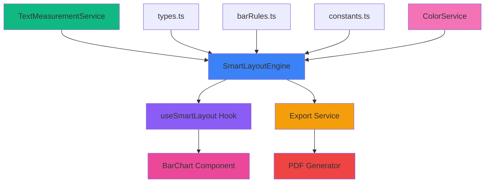
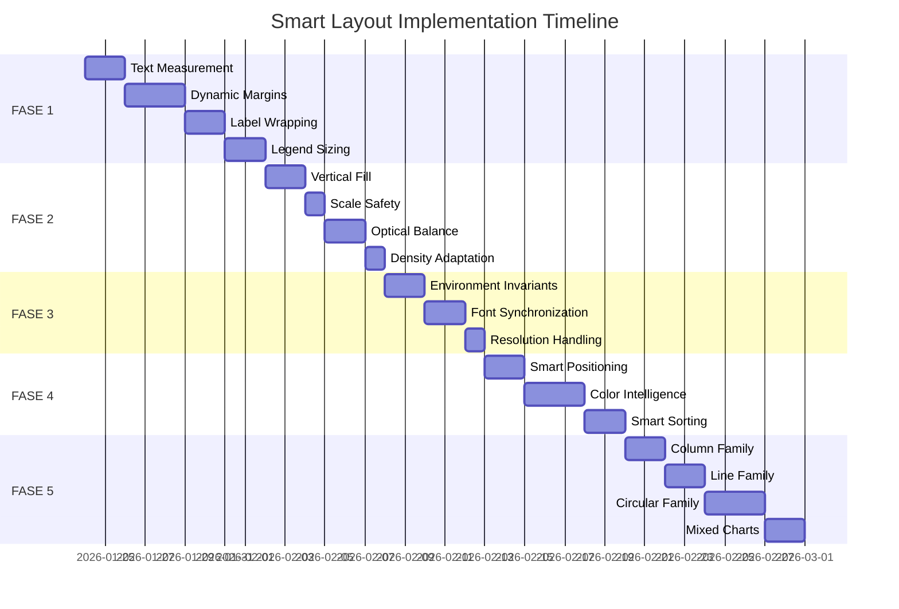

# Smart Layout System: Roadmap Reorganizado

> **Baseado em**: [Análise Refinada da Fase 4](../brain/analysis_phase4.md) e Feedback do Usuário
> **Status**: 5% implementado (estrutura básica existe)
> **Objetivo**: Substituir cálculos ad-hoc por um Engine centralizado e inteligente

---

## 🎯 Visão Geral

### Filosofia Core

**"Smart Engine → Dumb Component"**

- **Engine**: Calcula TODOS os valores (margins, thickness, positioning, wrapping)
- **Component**: Renderiza EXATAMENTE o que Engine mandou
- **Zero Guessing**: Medição precisa, não aproximações

### Priorização

- **P0 (Blocker)**: Sem isso, o sistema não funciona
- **P1 (Critical)**: Impacta qualidade visual drasticamente
- **P2 (Important)**: Melhoria significativa
- **P3 (Nice-to-have)**: Polimento fino

---

## 📊 Mapa de Dependências



**Legenda:**
- 🟢 Verde: Serviços utilitários
- 🔵 Azul: Engine (cérebro)
- 🟣 Roxo: Hooks (ponte)
- 🔴 Rosa: Components (UI)
- 🟠 Laranja: Export (PDF/PNG)
- 🌸 Rosa Claro: Color Intelligence

---

## 📚 Lessons Learned (Conversation History)

### Conversation 4331873d: Fix Cropped Chart Exports
**Problema**: Charts cortados em PDF, fonts erradas, legends invisíveis  
**Solução**: Aumentar `pixelRatio` para 3.5, normalizar altura, mapear fonts  
**Lição**: 
- Export precisa de cálculo de layout SEPARADO (não pode usar window size)
- Fonts precisam ser mapeadas explicitamente (Outfit/Geist Mono)
- Safety buffer de 40px é crítico para evitar edge clipping

### Conversation 6e818cda: Document Chart Variables
**Problema**: Variáveis espalhadas por múltiplos arquivos, difícil rastrear  
**Solução**: Documentar todas as variáveis e dependências  
**Lição**:
- Charts dependem de: `pdfExportService`, `exportUtils`, `chartTheme`, `GridConfig`
- Cada chart tem variáveis próprias (margins, padding, fontSize)
- Necessário centralizar em um único ponto de verdade (Engine)

### Conversation 1cbd9303: Refine Chart Layout and Export
**Problema**: Labels wrapping errado, legend ocupando espaço demais  
**Solução**: Engine calcula `labelWrapThreshold`, aggressive legend reclaim  
**Lição**:
- Wrapping não pode ser "guessing" (width / charWidth)
- Engine deve simular wrapping ANTES de renderizar
- Legend deve ocupar EXATAMENTE o espaço medido (zero buffer)

### Conversation 5870325a: Implement Design Tokens System
**Problema**: Valores hardcoded espalhados, difícil manter consistência  
**Solução**: CSS variables como design tokens  
**Lição**:
- Componentização requer separação estrita (Engine vs Component)
- Variable-First Rendering: calcular antes de renderizar
- Prop-to-Token Mapping: props devem mapear para tokens, não valores diretos

---

## 🚀 FASE 1: Core Engine (P0 - Blocker)

**Objetivo**: Engine funcional que substitui 100% da lógica legada

**Consolidates**: Sub-Projects 1.1, 1.5, 1.8, 1.11, 1.15, 1.44

### 1.1 Text Measurement & Caching

**Problema Atual**: `TextMeasurementService` existe mas não tem cache, não detecta font loading

**Tasks**:
- [ ] Implementar cache em `TextMeasurementService` (Map<string, number>)
- [ ] Adicionar font loading detection (`document.fonts.ready`)
- [ ] Adicionar batch measurement (medir múltiplos textos de uma vez)
- [ ] Implementar `calibrationFactor` para PDF rasterization drift

**Files**:
- [MODIFY] `src/services/smartLayout/TextMeasurementService.ts`

**Acceptance Criteria**:
- [ ] Medição com precisão ±2px
- [ ] Cache reduz medições repetidas em 80%+
- [ ] Font loading não causa layout shift
- [ ] PDF measurements são consistentes com screen

### 1.2 Dynamic Margins Solver

**Problema Atual**: Engine calcula margens básicas, mas Component ainda tem fallbacks complexos

**Tasks**:
- [ ] Implementar `computeDynamicMargins` completo para todas as posições
- [ ] Adicionar `exportBuffer` logic (safety margin para PDF)
- [ ] Implementar `assessOverflowRisk` (detectar quando texto vai vazar)
- [ ] Adicionar `Universal Legend Solver` (calcular espaço exato para legends)

**Files**:
- [MODIFY] `src/services/smartLayout/SmartLayoutEngine.ts`

**Acceptance Criteria**:
- [ ] Margens adaptam a labels de 5-100 caracteres
- [ ] User preference (legendPosition) sempre tem prioridade
- [ ] Export buffer previne clipping em PDF
- [ ] Legend ocupa exatamente o espaço medido (zero whitespace extra)

### 1.3 Label Wrapping Intelligence

**Problema Atual**: Component usa `width / charWidth` (guessing), não respeita boundary exato

**Tasks**:
- [x] Calcular `labelWidthThresholdPx` baseado em `marginLeft` reservado
- [x] Passar `labelWrapThreshold` via `typeSpecific` para component
- [x] Implementar wrapping simulation (prever quantas linhas ANTES de renderizar)
- [x] Adicionar `estimatedLines` logic científico
- [x] Implementar Stacked Layout Detection
- [x] Implementar Widow Prevention & 12-word limit

**Files**:
- [MODIFY] `src/services/smartLayout/SmartLayoutEngine.ts`
- [MODIFY] `src/features/charts/components/BarChart.tsx`

**Acceptance Criteria**:
- [x] Labels wrappam EXATAMENTE no boundary do gutter
- [x] Wrapping simulation reserva espaço vertical correto
- [x] Mudar window size: wrapping adapta precisamente
- [x] Zero "surpresas" (texto nunca overflow)
- [x] 12-word limit enforced
- [x] Widow prevention active

### 1.4 Legend Sizing (Predictive)

**Problema Atual**: Legends usam margin fixo, desperdiçam espaço

**Tasks**:
- [ ] Implementar `calculatePredictedLegendWidth` (para left/right)
- [ ] Implementar `calculatePredictedLegendHeight` (para top/bottom)
- [ ] Suportar todas as posições (top/bottom/left/right)
- [ ] Implementar "Compact Legend Grid" (CSS Grid ao invés de Flexbox)

**Files**:
- [MODIFY] `src/services/smartLayout/SmartLayoutEngine.ts`

**Acceptance Criteria**:
- [ ] Legend bottom: altura = `lines * itemHeight` (zero buffer)
- [ ] Legend lateral: largura = `maxItemWidth + 16px` (padding)
- [ ] Chart expande para preencher espaço economizado
- [ ] Legends curtas (1-2 items) usam espaço mínimo

---

### Verification (FASE 1)

**Unit Tests**:
```bash
npm test -- SmartLayoutEngine.test.ts
npm test -- TextMeasurementService.test.ts
```

**Integration Test**:
- [ ] BarChart usa 100% Engine (zero fallback)
- [ ] Remover linhas 103-106 de `BarChart.tsx` (fallback logic)
- [ ] Dashboard com 5 charts diferentes renderiza corretamente

**Visual Test**:
- [ ] Labels longos (50+ chars): margin expande, zero truncation
- [ ] Labels curtos (5 chars): margin compacta, chart expande
- [ ] Legend com 1 item: usa espaço mínimo
- [ ] Legend com 10 items: wraps corretamente

---

## 🎨 FASE 2: Visual Refinement (P1 - Critical)

**Objetivo**: Charts sempre preenchem o container de forma elegante

**Consolidates**: Sub-Projects 1.2, 1.3, 1.4, 1.6, 1.7, 1.10, 1.12, 1.14, 1.42

### 2.1 Vertical Fill Strategy

**Problema**: Charts "flutuam" em containers grandes, desperdiçam whitespace

**Tasks**:
- [ ] Implementar `Vertical Fill Strategy` (preencher plotHeight)
- [ ] Adicionar density-aware scaling (low density = thicker bars)
- [ ] Implementar caps dinâmicos baseados em densidade

**Acceptance Criteria**:
- [ ] Charts preenchem 100% da altura do container (até cap)
- [ ] Low density (2-3 categories): bars até 80px
- [ ] High density (20+ categories): bars mínimo 12px

### 2.2 Scale Safety (Caps)

**Problema**: Containers grandes + poucas categorias = bars gigantes

**Tasks**:
- [ ] Implementar `maxBarThickness` cap (60-80px)
- [ ] Decouple `fontSize` de `barHeight` (prevenir fonts gigantes)
- [ ] Implementar `Fill Factor Limit` (não preencher 100% se violar normas)

**Acceptance Criteria**:
- [ ] Bars nunca excedem 80px de altura
- [ ] Fonts permanecem legíveis (não gigantes)
- [ ] Whitespace é distribuído elegantemente

### 2.3 Optical Balance & Gutter

**Problema**: Distância entre labels e bars parece inconsistente

**Tasks**:
- [ ] Calcular `labelPadding` baseado em `baseFontSize` (0.8 * fontSize)
- [ ] Passar `categoryLabelX` e `categoryLabelAnchor` via `typeSpecific`
- [ ] Implementar "Optical Gutter" (distância respirável)

**Acceptance Criteria**:
- [ ] Infographic: labels têm distância de ~18px das bars
- [ ] Classic: labels alinhados corretamente no eixo
- [ ] Distância é proporcional ao fontSize

### 2.4 Density Adaptation

**Problema**: Mesma lógica para charts densos e esparsos

**Tasks**:
- [ ] Calcular `density = categoryCount / (plotHeight / 100)`
- [ ] Ajustar caps baseado em densidade
- [ ] Implementar "Adaptive Thickness Intelligence"

**Acceptance Criteria**:
- [ ] Low density: targetFill = 0.75, maxThickness = 80px
- [ ] High density: targetFill = 0.6, maxThickness = 40px

---

### Verification (FASE 2)

**Visual Tests**:
- [ ] 3 categories em 600px altura: bars ~70px, centradas
- [ ] 20 categories em 400px altura: bars ~15px, preenchem tudo
- [ ] Labels têm distância consistente das bars

---

## 📄 FASE 3: Export Fidelity (P1 - Critical)

**Objetivo**: PDF = Screen (1:1 fidelity)

**Consolidates**: Sub-Project 2 completo + 1.7

### 3.1 Environment Invariants

**Problema**: PDF usa window size, causando layouts diferentes

**Tasks**:
- [ ] Hardcode `EXPORT_PIXEL_RATIO = 3.5` (configurável)
- [ ] Implementar "Virtual Canvas" dimensions para PDF
- [ ] Adicionar `target: 'screen' | 'pdf'` parameter em `computeLayout`

**Acceptance Criteria**:
- [ ] PDF ignora window size
- [ ] Layout é calculado baseado em dimensões virtuais
- [ ] Screen e PDF têm mesmas proporções relativas

### 3.2 Font Synchronization

**Problema**: PDF usa fonts diferentes, causando medições erradas

**Tasks**:
- [ ] Carregar Outfit e Geist Mono em `globals.css`
- [ ] Criar `.category-label` e `.data-value` utility classes
- [ ] Atualizar `TextMeasurementService` para usar fonts corretas
- [ ] Simplificar `fontEmbedCSS` em `exportUtils.ts`

**Acceptance Criteria**:
- [ ] PDF usa Outfit para labels
- [ ] PDF usa Geist Mono para valores
- [ ] Medições são idênticas entre screen e PDF

### 3.3 Resolution Handling & Safety Buffers

**Problema**: Texto clippa nas bordas do PDF

**Tasks**:
- [ ] Implementar `exportBuffer` (safety margin)
- [ ] Converter padding fixo (40px) em invariants que escalam
- [ ] Implementar `calibrationFactor` para rasterization drift

**Acceptance Criteria**:
- [ ] Zero clipping em PDF exports
- [ ] Safety buffer de 40px é respeitado
- [ ] Texto nunca corta nas bordas

---

### Verification (FASE 3)

**Export Tests**:
```bash
# Criar dashboard com charts variados
# Exportar para PDF
# Comparar visualmente com screen
```

**Success Criteria**:
- [ ] Fonts idênticas (Outfit/Geist Mono)
- [ ] Cores idênticas
- [ ] Espaçamentos idênticos
- [ ] Zero truncation (`...`)
- [ ] Zero clipping (bordas)

---

## 🧠 FASE 4: Advanced Intelligence (P2 - Important)

**Objetivo**: Charts auto-otimizam para storytelling e consistência visual

**Consolidates**: Sub-Projects 1.16-1.29

### 4.1 Smart Positioning (Anchor Point)

**Problema**: Valores sempre à direita, mesmo quando caberiam dentro

**Tasks**:
- [ ] Implementar lógica: `barWidth > labelWidth + 20px` → inside
- [ ] Passar `valuePositioning: 'inside' | 'outside' | 'top'` via `typeSpecific`
- [ ] **Tie-breaker de Contraste**: Se contraste for insuficiente mesmo com texto branco, forçar `outside`

---

### 4.2 Color Intelligence & Contrast

**Problema**: Engine desconhece cores (resolvidas no Componente), impedindo cálculo de contraste.

**Tasks**:
- [ ] **Criar `ColorService`**: Centralizar resolução de paletas e interpolations (migrar de `utils/colors.ts`)
- [ ] Integração: Engine consome `ColorService` para saber exatamente qual cor cada barra terá
- [ ] **Contrast-Awareness**: Engine calcula `textColor` ('black' | 'white') baseado na cor da barra (Luminance YIQ)

---

### 4.3 Smart Sorting

**Problema**: Dados desordenados dificultam comparação rápida.

**Tasks**:
- [ ] Implementar `autoSort` boolean (descending by value)
- [ ] Garantir que cores seguem a identidade da categoria (não a posição visual)
- [ ] Animar reordenação (se possível via framer-motion ou CSS)

---

### Verification (FASE 4)

**Visual Tests**:
- [ ] Valores dentro/fora adaptam-se ao tamanho da barra
- [ ] Texto sempre legível (preto em claro, branco em escuro)
- [ ] Auto-sort organiza dados do maior para o menor

---

## 🔄 FASE 5: Component Expansion (P2 - Important)

**Objetivo**: Todos os 16 charts usam Engine

**Consolidates**: Sub-Project 3

### 5.1 Column Family

**Charts**: `ColumnChart`, `StackedColumnChart`

**Challenge**: Staggered labels, dynamic bottom margin

**Tasks**:
- [ ] Criar `columnRules.ts`
- [ ] Implementar wrap-or-stagger strategy para X-axis
- [ ] Conectar `ColumnChart.tsx` ao Engine

### 5.2 Line Family

**Charts**: `LineChart`, `AreaChart`

**Challenge**: Continuous scales, aspect ratio preference

**Tasks**:
- [ ] Criar `lineRules.ts`
- [ ] Priorizar aspect ratio 16:9
- [ ] Garantir `minPlotWidth` para evitar linhas squashed

### 5.3 Circular Family

**Charts**: `PieChart`, `DonutChart`, `RadarChart`, `GaugeChart`

**Challenge**: 1:1 aspect ratio, external labels

**Tasks**:
- [ ] Criar `radialRules.ts`
- [ ] Implementar square constraints
- [ ] Implementar "Spider Legs" para labels

### 5.4 Mixed Charts

**Charts**: `MixedChart`, `PictogramChart`

**Challenge**: Dual-axis, non-standard grids

**Tasks**:
- [ ] Criar `mixedRules.ts`
- [ ] Implementar dual-axis margin reservation

---

### Verification (FASE 5)

**Regression Test**:
- [ ] Dashboard com 1 de cada tipo (16 charts)
- [ ] Todos renderizam corretamente
- [ ] Export PDF: todos visíveis, centralizados, sem crop

---

## 📋 Definition of Done

### Por Fase:

**FASE 1 (Core Engine)**:
- [ ] `npm test` passa (unit tests)
- [ ] `npm run build` passa (zero TypeScript errors)
- [ ] BarChart usa 100% Engine (fallback removido)
- [ ] Dashboard visual test passa

**FASE 2 (Visual Refinement)**:
- [ ] Charts preenchem containers elegantemente
- [ ] Density adaptation funciona (low/high)
- [ ] Optical balance é consistente

**FASE 3 (Export Fidelity)**:
- [ ] PDF = Screen (1:1 visual)
- [ ] Zero truncation
- [ ] Zero clipping
- [ ] Fonts corretas

**FASE 4 (Advanced Intelligence)**:
- [ ] ColorService centralizado e integrado
- [ ] Contraste automático funcionando (black/white text)
- [ ] Smart Positioning (inside/outside) funcionando
- [ ] Smart Sorting funcionando

**FASE 5 (Expansion)**:
- [ ] Todos os 16 charts usam Engine
- [ ] Zero regressions
- [ ] Export test passa

---

## 🎯 Roadmap Visual



**Estimativa Total**: ~6-8 semanas (assumindo trabalho focado)

---

## 🚨 Riscos & Mitigações

### Risco 1: Performance (Text Measurement)
**Problema**: Medir texto para cada label pode ser lento
**Mitigação**: Cache agressivo, batch measurements, Web Workers.

### Risco 2: Complexity Creep
**Problema**: Engine pode ficar muito complexo
**Mitigação**: Manter Engine stateless, separar concerns, tests unitários.

### Risco 3: Migration Resistance
**Problema**: Componentes legados podem resistir à mudança
**Mitigação**: Migrar um chart por vez, fallbacks temporários, regression tests.

### Risco 4: Architectural Conflict (Color Resolution)
**Problema**: Engine precisa de cores para contraste, mas cores são resolvidas no Componente.
**Mitigação**: Implementar `ColorService` na FASE 4 para centralizar essa lógica e injetar cores resolvidas no Engine.

---

## 📚 Referências

- **Related Skills**: 
  - `componentization`: Separation of concerns
  - `system_architecture`: Measurement-first, LOD principles
  - `task_breakdown`: Phased execution

---

## ✅ Next Steps

1. **Review este roadmap** com o time
2. **Criar task.md** para FASE 1
3. **Começar com 1.1** (Text Measurement & Caching)
4. **Iterar rapidamente** com testes visuais


----------------------------


# Smart Layout: Phase 4 - Advanced Intelligence

> **Foco**: Inteligência Visual e Automática
> **Status**: Planejamento (P2 - Important)
> **Dependências**: Core Engine (Fase 1) implantado

---

## 🎯 Objetivo
Transformar os gráficos em componentes "inteligentes" que tomam decisões visuais sofisticadas automaticamente, sem necessidade de configuração manual do usuário.

---

## 🚀 Escopo da Fase

### 4.1 Smart Positioning (Anchor Point)

**Problema**: Atualmente, valores numéricos ficam sempre à direita (`outside`), mesmo quando a barra é larga o suficiente para acomodá-los internamente.

**Solução**:
Implementar lógica de posicionamento dinâmico baseado no tamanho relativo da barra vs. tamanho do texto.

**Tasks**:
- [ ] **Geometry Check**: Implementar lógica `if (barWidth > textWidth + padding) -> try_inside`.
- [ ] **Tie-Breaker de Contraste**: Mesmo que caiba, verificar se o contraste é suficiente. Se `barColor` for muito clara e texto for branco -> forçar `outside` (ou usar texto preto, ver 4.2).
- [ ] **API Update**: Passar `valuePositioning: 'inside' | 'outside' | 'top'` via `typeSpecific` do Engine.

**Regra de Ouro**:
> "Se cabe E é legível, coloque dentro. Se não, coloque fora."

---

### 4.2 Color Intelligence & Contrast Service

**Problema**: O `SmartLayoutEngine` calcula apenas geometria, mas decisões visuais (como cor do texto) dependem da cor da barra. Atualmente, cores são resolvidas apenas no render do componente (late binding), impedindo o Engine de garantir acessibilidade.

**Solução**:
Centralizar a resolução de cores em um `ColorService` que seja consumido tanto pelo Engine quanto pelo Componente.

**Tasks**:
- [ ] **Criar `ColorService`**: Migrar lógica de `utils/colors.ts` (geração de paletas, hex manipulation).
- [ ] **Integrar no Engine**: Engine deve receber a paleta ou resolver as cores durante `analyzeChart`.
- [ ] **Contrast Calculation**: Implementar cálculo YIQ (Luminance) para determinar `textColor` ideal ('black' | 'white').
- [ ] **Output**: Retornar `datasetColors` e `textColors` dentro do `computedLayout`.

**Benefício**:
Garante que textos "inside" sejam sempre legíveis (fundo escuro = texto branco, fundo claro = texto preto).

---

### 4.3 Smart Sorting

**Problema**: Dados desordenados dificultam a comparação rápida e storytelling ("Qual é o maior?").

**Solução**:
Ordenar automaticamente os dados para facilitar a leitura, mantendo a consistência visual.

**Tasks**:
- [ ] **Auto-Sort Logic**: Adicionar `autoSort: boolean` (default: false). Se true, ordenar valores descending.
- [ ] **Identity Preservation**: Garantir que as cores sigam a **categoria** e não a **posição visual**. (Ex: "Sul" deve ser sempre Azul, mesmo se mudar de 1º para 3º lugar).
- [ ] **Animation Support**: Preparar estrutura para que a reordenação possa ser animada (Framer Motion / CSS transitions).

---

## ✅ Critérios de Aceite (Definition of Done)

1. **Posicionamento**:
   - Barras largas (>80px) mostram valor dentro.
   - Barras curtas mostram valor fora.
   - Sem sobreposição visual em nenhum caso.

2. **Cores & Contraste**:
   - `ColorService` existe e é a única fonte de verdade para cores.
   - Textos sobre barras escuras são brancos.
   - Textos sobre barras claras são pretos.

3. **Ordenação**:
   - Flag `autoSort` ordena visualmente as barras.
   - Cores das categorias permanecem consistentes após ordenação.

---

## 🧩 Notas de Implementação

- **Dependência Arquitetural**: A criação do `ColorService` é pré-requisito para o item 4.1 funcionar perfeitamente (devido ao tie-breaker de contraste).
- **Performance**: O cálculo de contraste é rápido (matemática simples), não deve impactar performance.
